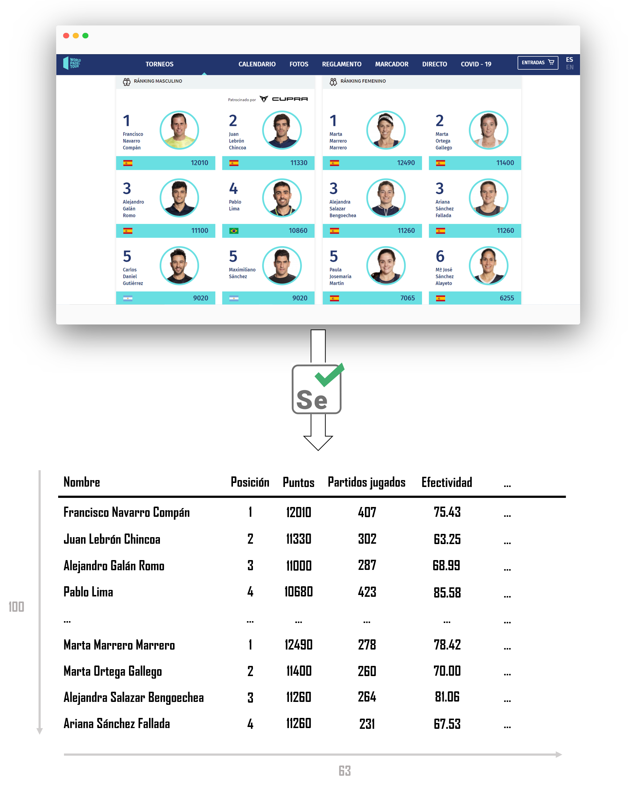

```{r setup, include=FALSE}
knitr::opts_chunk$set(echo = TRUE)
```

## Introducción

En este documento se expone el informe final del caso práctico resuelto de *web scraping*, enmarcado en el contexto de la resolución de la Práctica 1 de la asignatura **Tipología y ciclo de vida de los datos** del **Máster en Ciencia de Datos (*Data Science*)** de la **Universitat Oberta de Catalunya**.

En esta práctica se ha llevado a cabo la construcción de un conjunto de datos con información de los mejores jugadores de padel del mundo. En concreto, se extrajo información del sitio web del World Padel Tour y se recogió información tanto de la clasificación mundial masculina como femenina.

Para ello, se utilizó `Python` como herramienta principal, destacando el uso de la librería `Selenium`, especialmente útil a la hora de trabajar con páginas web dinámicas como la que nos hemos enfrentado. 

## Contexto

A día de hoy, el pádel se sitúa como uno de los deportes más en auge de España. Cada vez son más las personas que disfrutan de él a todos los niveles y que lo practican de manera habitual. A nivel profesional, el circuito profesional del World Padel Tour se sitúa como el principal campeonato internacional, donde los mejores jugadores y jugadoras recorren el mundo compitiendo y proporcionando un espectáculo único.

No obstante, es un deporte relativamente reciente y que principalmente es practicado por hispanohablantes, por lo que su popularidad aun no llega a la de otras disciplinas como el tenis o el fútbol. En consecuencia, es uno de esos campos en los que la analítica de datos todavía no ha irrumpido con la misma magnitud que en otros ámbitos, y las contribuciones a nivel de bases de datos, investigación o tecnología son escasas.

En este contexto se enmarca la elaboración de esta práctica, que pretende realizar un ejercicio de *web scraping* para extraer desde la página oficial de World Padel Tour (`https://www.worldpadeltour.com/`) información tanto personal como deportiva de los mejores jugadores y jugadoras del mundo, y construir un conjunto de datos con dicha información. El resultado del ejercicio supondrá el primer conjunto de datos abierto de jugadores de padel profesional y una de las primeras contribuciones a nivel internacional.

## Título del conjunto de datos

*Top 100 World Padel Tour Dataset*

## Descripción del conjunto de datos

Como resultado del ejercicio de *web scraping*, se ha obtenido un conjunto de datos que contiene la información de los 200 mejores jugadores de padel actuales del circuito World Padel Tour: los 100 mejores del ranking masculino y las 100 mejores del ranking femenino. Se extrayeron tanto características personales de los jugadores (nombre completo, altura, fecha de nacimiento...) como deportivas, incluyendo datos relativos a su carrera profesional completa como los resultados de competeción más destacables obtenidos en los años mas recientes. En el apartado titulado Contenido se encuentra una descripción más detallada de los campos obtenidos del conjunto de datos.




## Representación gráfica

En la Figura 1 del documento se incluye una representación gráfica que ilustra el proceso seguido para la realización del proyecto.

## Contenido

A continuación se detallan cada una de las características que han sido recogidas para cada uno de los profesionales.

- **`Nombre`**: Nombre del jugador en el formato recogido por la página de World Padel Tour.

- **`Ranking`**: Posición en el ránking World Padel Tour.

- **`Puntuacion`**: Puntuación según el sistema de puntuación de World Padel Tour.

- **`Companero`**: Compañero profesional actual del jugador.

- **`Posicion`**: Posición habitual en pista del jugador: *drive* o *revés*.

- **`LugarNacimiento`**: Lugar de nacimiento del jugador.

- **`FechaNacimiento`**: Fecha de nacimiento del jugador, en formato `DD/MM/AAAA`.

- **`Altura`**: Altura del jugador en metros.

- **`Residencia`**: Lugar de residencia habitual del jugador.

- **`PartidosJugados`**: Número total de partidos jugados desde que se tienen registros en World Padel Tour.

- **`PartidosGanados`**: Número total de partidos ganados.

- **`PartidosPerdidos`**: Número total de partidos perdidos.

- **`Rendimiento`**: Porcentaje total de victorias.

- **`Racha`**: Mayor racha de partidos ganados de manera consecutiva.

- **`Circuito`**. Circuito al que pertenece el jugador: *masculino* o *femenino*

Por otra parte, para cada uno de los años disponibles en cada jugador entre 2013 y 2020, se recogieron algunas características adicionales:

- **`20**_PartidosJugados`**: Número de partidos jugados en el año 20**.

- **`20**_PartidosGanados`**: Número de partidos ganados en el año 20**.

- **`20**_PartidosPerdidos`**: Número de partidos ganados en el año 20**.

- **`20**_Rendimiento`**: Porcentaje de victorias en el año 20**.

- **`20**_Torneos`**: Número de torneos ganados en el año 20**.

- **`20**_Finales`**: Número de finales alcanzadas (sin conseguir el título) en el año 20**.

Las variables recogidas en el conjunto de datos en el momento de su extracción (7 de noviembre de 2020) se encuentran actualizados con fecha del 30 de marzo de 2020, tal y como se indica en la página oficial, recogiendo información desde la temporada 2013 hasta esa fecha. Dicho desfase se debe a la parada en la actualización del ranking en consecuencia de la pandemia causada por la enfermedad del SARS-CoV-2. Cabe mencionar que, en condicones normales, la frecuencia de actulización de la clasificación del World Padel Tour es semanal.

Para acceder a los datos de cada jugador, en primer lugar se almacenó el enlace de referencia de su página web y posteriormente se accedio al mismo para la colección de la información. Para una mayor comprensión de cómo se recogieron los datos, puede dirijirse al archivo `scraper.py` del repositorio, donde se encuentra el código desarrollado y la manera de obtener cada variable.

## Agradecimientos

En primer lugar, nos gustaría agradecer a World Padel Tour la creación y mantenimiento de su página web oficial. No solo se agredece la facilidad a la hora de poder acceder a los datos de sus jugadores, sino también la disponibilidad de documentos adicionales para comprender, por ejemplo, el sistema de puntuación por torneos o las medidas adoptadas dada la situación excepcional de pandemia.

Por otra parte, nos gustaría agradecer también al propietario la permisividad a la hora de poder acceder al contenido de su sitio web, sin necsidad de registros y estableciendo muy pocas limitaciones a la hora de rastrearlo o, en nuestro caso, poder realizar de manera satisfactoria un ejercicio de *web scraping*. Para analizar dichas restricciones, se llevó a cabo una exploración del archivo *robots.txt* del sitio web. En respuesta, los autores hemos intentado en todo momento seguir unas buenas prácticas y unos principios éticos a la hora de realizar el proyecto, buscando no saturar el servidor del sitio web con un número muy elevado de peticiones consecutivas, espaciando cada una de ellas 10 segundos, tal y como el propietario indicaba.

Otros recursos utilizados para el desarrollo del proyecto se enumeran a continaución:

- Subirats, L., Calvo, M. (2019). Web Scraping. Editorial UOC.

- Lawson, R. (2015). Web Scraping with Python. Packt Publishing Ltd.

- Buelta, J. (2020). Python Automation Cookbook. Packt Publishing Ltd.

Finalmente, como en cualquier proyecto que utilice recursos *open source*, nos gustaría dar las gracias a todas las personas que hacen posible la existencia de herramientas como `Python` o ``Selenium`.

## Inspiración

Existen una serie de factores que motivan a la creación del conjunto de datos reportado. Como ya hemos dicho, el conjunto de datos supone una de las primeras contribuciones en el ámbito del pádel en cuanto a material, lo que obviamente supone un añadido motivacional.

A nivel de análisis, surgen muchas posibilidades que pueden resultar interesantes. Por ejemplo, podemos obtener una visión comparativa entre jugadores en base a sus resultados a lo largo de su carrera, como por ejemplo, su efectividad o el número de partidos jugados. Por otra parte, al disponer de datos históricos de temporadas anteriores, podemos establecer análisis temporales que nos permitan conocer la evolución de algunos jugadores, y poder visualizar, por ejemplo, como han ido emergiendo a lo largo de los años algunos de los jugadores que hoy en día se sitúan entre los 10 mejores del mundo. Otra opción podría ser, dado un enfrentamiento en un torneo oficial, establecer una comparativa entre los 4 jugadores y conocer, por ejemplo, qué pareja acumula más partidos en la presente temporada, lo que podría traducirse en un mayor deterioro físico.

Todos estos ejemplos de análisis no parecen muy complejos. No obstante, podría resultar todo un añadido a la hora de complementar información adicional en la retransmisión de los partidos durante los torneos y enriquecer la experiencia del espectador.

Finalmente, nos gustaría comentar que este conjunto de datos podría utilizarse como base para futuras mejoras que incorporasen, por ejemplo, estadísticas específicas de golpes por partido y otros factores determinantes del juego. Toda esa información, no obstante, a día de hoy no puede obtenerse del sitio web oficial de World Padel Tour, y animamos a la organización a que algún día pueda recogerse y ser accesible para el público general.

## Licencia

Tanto para el repositorio como para el conjunto de datos hemos decidio definir como licencia *MIT License*, al ser una de las más permisivas y de las más utilizadas en Github. Entendemos que, para un ámbito que tanto está por explorar y que tanto necesita de colaboradores que contribuyan al mismo, esta licencia puede ser idónea por los siguientes motivos:

- Permise el uso comercial y privado del contenido del repositorio, asi como la posiblidad de modificarlo y distribuirlo libremente. En otras palabras, permite el uso del repositorio tanto para software libre como no libre, lo que puede facilitar su desarrollo sin limitaciones.

- La única condición a remarcar es que el *copyright* y la nota de licencia deben ser incluidos siempre que se referencie el contenido del repositorio.

- Por último, cabe mencionar que el repositorio y todo su contenido no ofrece ningun tipo de garantía por partes de los autores o cualquier tipo de responabilidad adicional.

## Código

El código para la realización del ejercicio de *web scraping* ha sido desarrollado en lenguaje `Python`, y el principal script desarrollado se encuentra en el archivo `scraper.py`, dentro del repositorio `https://github.com/albergcg/wpt_webscraping`. 

A lo largo del proyecto, los autores nos hemos enfrentado a una serie de problemas a la hora de desarrollar el código y poder acceder a toda la información requerida de cada jugador. No obstante, consideramos que hemos encontrado la solución a todos ellos:

- En un primer lugar, se consideró la opción de realizar el ejercicio de *web scraping* utilizando la librería `beautifulsoup`, una de los opciones más recurridas para proyectos de este tipo en caso de utilizar `Python` como principal herramienta. No obstante, al enfrentarnos a una página web dinámica, esta opción no fue suficiente al tener que llevar a cabo opciones más avanzadas como el desplazamiento de la página web (*scrolling*) hasta cierto punto de la misma o la selección interactiva de algunos elementos. En consecuencia, se decidió utilizar `Selenium` como principal librería para la recogida de los datos.

- Cabe mencionar que, aunque no se incluye como contenido final del proyecto, se realizaron algunas pruebas iniciales con `beautifulsoup` que nos permitieron conocer el funcionamiento de la herramienta, puediendo, por ejemplo, obtener los enlaces de los 10 primeros jugadores de la clasificación.

- Para llevar a cabo la lectura de los enlaces de cada jugador, nos enfrentamos al problema del desplazamiento infinito de la página web del ranking. Por defecto, dicho desplazamiento se realizaba hasta visualizar todos los jugadores disponibles en la clasificación, algo que en nuestro caso era innecesario al precisar únicamente de los enlaces de los 100 primeros jugadores, dando lugar además a un número de peticiones al servidor innecesario. Para resolver este problema, implementamos un bucle capaz de realizar el desplazamiento únicamente hasta la posición deseada, en nuestro caso el jugador en la posición 100. Tras esto, fuímos capaces de almacenar los enlaces a la página web personal de cada jugador para posteriormente acceder a ellos y comenzar la obtención de datos.

- Para cada jugador, accedimos a su página personal dentro de la web de World Padel Tour. Uno de los problemas encontrados en esta parte fue la obtención de la información personal (fecha de nacimiento, altura...), que se encontraba oculta en una pestaña dentro de la página web. En esta ocasión, dicha información se encontraba accesible en una pestaña, pero que sin embargo no podía accederse mediante la dirección URL. Para solucionar este problema, hicimos uso de las posibilidades que `Selenium` ofrecía y realizamos un click sobre el elemento web correspondiente a la pestaña, permitiendo desplegar la información requerida y permitiendo su acceso. Cabe mencionar que esta opción no implicó una nueva petición al servidor, algo que pudimos observar analizando el tráfico del sitio web durante el proceso.

- Otro de los grandes obstáculos que nos encontramos fue la obtención de los datos anuales de cada jugador. En este sentido, encontramos dos grandes problemas que nos dificultaron en gran medida dicho proceso:

  - En primer lugar, nos encontramos con un desplegable dinámico que permitía la selección de cada uno de los años. No obstante, realizar dicha selección supuso un problema, ya que cada una de las opciones disponibles no podían accerderse mediante URL y el desplegable por defecto no se encontraba desplegado. Para solucionar este problema, especificamos un cambio de atributo al elemento web para que se desplegaran los años disponibles para el jugador. Una vez desplegados, recurrimos a realizar un click sobre cada uno de los años de manera secuencial para poder visualizar la información al año en cuestión. De esta manera, pudimos recorrer todos los años disponibles para cada jugador y acceder a sus estadísticas anuales.
  
  - Otro problema encontrado fue que los años disponbles para cada jugador no eran fijos. Por ejemplo, en el caso de Agustín Tapia, con motivo de su corta edad, no se encontró disponible la información anterior a 2017, puesto aun no se había convertido en jugador profesional. Para solucionar este problema, decidimos recoger los años disponibles para cada jugador y, de manera que si para alguno de los años especificados (2013-2020) el jugador no presentaba estadísticas, las variables asociadas a ese año quedarían definidas por el signo '?', indicando su ausencia.
  
- Por último, cabe mencionar que tuvimos dudas en algunos momentos sobre si alguna de las acciones llevadas a cabo implicaban una nueva petición al servidor. Para ello, utilizamos las herramientas de desarrollador de Chrome para analizar el tráfico de peticiones en el servidor. De esta manera pudimos comprobar, por ejemplo, que la selecciones mediante click mencionadas en los apartados anteriores no implicaban una nueva petición sobre el servidor, mientras que cada actualización de la página web a la hora de realizar un nuevo desplazamiento sí. En base a esta información, se incluyeron en el script definitivo diferentes pausas programadas de 10 segundos, tal y como se especifica en el archivo *robots.txt* de la página oficial de World Padel Tour.

## Dataset

El dataset ha sido publicado en Zenodo con DOI...

## Contribuciones

- Investigación previa: Alberto García Galindo y Federico Alejandro Floriano Pardal.

- Redacción de las respuestas: Alberto García Galindo y Federico Alejandro Floriano Pardal.

- Desarrollo del código: Alberto García Galindo y Federico Alejandro Floriano Pardal.


